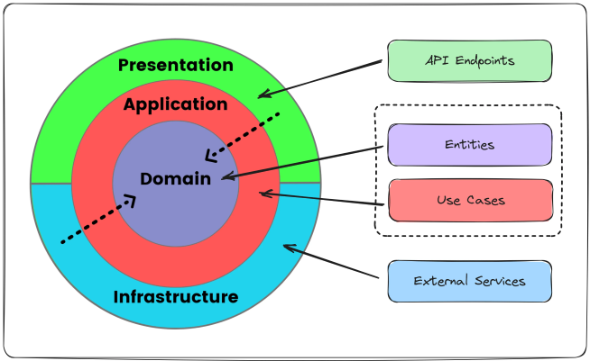

# Substitutiva Fiap - Fase 3

---

## Challenge Veículos API

API desenvolvida como plataforma para revenda de veículos.

---

## Tecnologias Utilizadas


-  **Java 17**

-  **Spring Boot 3.x**

-  **Spring Data JPA**

-  **Spring Security (com JWT)**

-  **PostgreSQL**

-  **Docker / Docker Compose**

-  **Swagger / OpenAPI**

-  **JUnit 5 + Mockito**

-  **GitHub Actions (CI/CD)**

---

- [Substitutiva Fiap - Fase 3](#tech-challenge-fiap---fase-3-substitutiva)
    - [Como rodar?](#como-rodar)
    - [Arquitetura](#arquitetura)
    - [Testes Automatizados](#arquitetura)
    - [Estrutura de pastas](#estrutura-de-pastas)
  
---

## Como rodar?

Pré-requisitos:

-  **Java 17+**
-  **Maven: 3.+**
-  **Docker e Docker Compose**

Para executar localmente:

```shell
# Primeiro: Clone o repositório
git clone https://github.com/marcuspioner/challengeVeiculos.git
cd challengeVeiculos/

# Segundo: Suba o banco de dados com Docker
docker-compose up -d

# Terceiro: Rode a aplicação localmente
./mvnw spring-boot:run
```

Para executar via docker compose:

```shell
# Primeiro: Clone o repositório
git clone https://github.com/marcuspionerfiap/challengeVeiculos.git
cd challengeVeiculos/

# Segundo: Suba os containers via Docker
docker-compose up -d
```

Após a execução dos comandos acima, será possível acessar o Swagger por meio do endpoint:

```http request
http://localhost:8081/swagger-ui/index.html
```

Este endpoint permite o teste das funcionalidades da aplicação pela web.

---

## Testes Automatizados

A API conta com testes unitários e de integração, desenvolvidos com:


-  **JUnit  5**

-  **Mockito**

Para executá-los:

```bash
./mvnw  test
 ```
---

## Arquitetura

Para o desenvolvimento do projeto, foi utilizada a Arquitetura Clean Architecture.


Fonte: https://blog.stackademic.com/design-application-using-clean-architecture-9ff7ccad79bb

---

## Estrutura de pastas

```
.
└── src/
    ├── application/
    │   └── services
    ├── config/
    │   └── configurations
    ├── domain/
    │   └── entities
    ├── infrastructure/
    │   └── repositories
    └── presentation/
        └── controllers
```
---

Desenvolvido por: Marcus Vinicius de Moraes Pioner